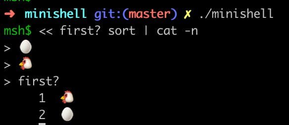

# MINISHELL #

Minishell is a project of school 42, in which you need to create your own little ``bash``. The project was carried out by [Gumada Yaroslav](https://github.com/GumadaYaroslav) and [Taras Levko](https://github.com/alchrist42).

### Launching the program :
  ```
make && ./minishell
  ```
### An example of using the program :


### Available options

Minishell runs executables from an absolute, relative or environment PATH (``/bin/ls`` or ``ls``), including arguments or options. ``'`` and ``"`` work the same as bash, except for multiline commands.

You can separate commands with ``;``, as well as use redirections ``>`` ``>>`` ``<`` and pipes ``|``.

Environment variables are handled, like ``$HOME``, including the return code ``$?``.

Finally, you can use ``Ctrl-C`` to interrupt and ``Ctrl-\`` to quit a program, as well as ``Ctrl-D`` to throw an EOF, same as in bash.

A few of the functions are "built-in", meaning we don't call the executable, we re-coded them directly. It's the case for ``echo``, ``pwd``, ``cd``, ``env``, ``export``, ``unset`` and ``exit``.
